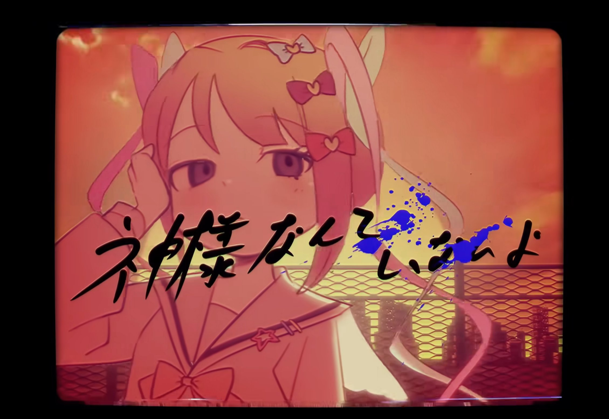

# 拉普拉斯妖

***我最近很喜欢的一个概念。***

**_它叫拉普拉斯妖。_**如果有这么一个智能的存在，它能精准知道宇宙中每个粒子的位置和动量，那么它就能靠可怕的计算能力推导出既定的未来。也就是说，我们的未来是被上帝决定好的。只是，拉普拉斯妖是不存在的，决定论已然被量子力学的随机性证伪了。  

此刻是清明节假期，一切客观条件都挺好的，宿舍不断电了，外面下着小雨，很阴暗，阴暗中台灯的暖色光，投射冷色光芒的屏幕，流动着彩灯的键盘，显得温馨而安全，放着几年前收藏的歌，甚至有点点想哭。时间不少，但也不多，我有好多事情要做，有好多事情可以做，都不想做。

**真是的，为什么不存在呢？能算到自己的未来，很诱人不是吗？**

# “我”是谁呢？

前两天我失眠了，忘了被什么触发，我进入了自我剖析状态，将自己解离出来，观察着自己。

**_“我”是那个由三个字组成的名字？_**重名的人很多吧，况且我还有很多网名呢。  

我是一切社会关系的集合？马克思是这么说的吧？我是父母的孩子，老师的学生，是所有人认识的我，但如果我不再认识别人，也不再被人认识，我又是什么？

我是一个生物学意义上的人？那我为什么不是别人，而很特别地是“我”？况且，我的细胞不断更新迭代，能量不断循环流动…哈哈，忒修斯之船。  

似乎除去外物对我的定义，我无法回答“我”是谁了。可是外物的定义是如此易碎呐，我拥有的东西就能定义我吗？

如果我的学科知识没有考试来证明，我的技术知识没办法输出成果，如果我的身体终将化成灰烬，好像在一个听不懂中文的土著国说中文一样，外物好像也不能定义“我”么？

我开始试着和ai聊聊

> ***“你是空的。”***
>
> *你想要把你身上的衣服都剥下来，看看里面是什么，然后发现，里面什么都没有，你想把你自己像容器一样倒干净，发现容器是空的。这个正在剥衣服的意识就是你，这个容器是你，这个想要觉知的觉知是你。你不是一个拥有这些状态的东西，你就是这个状态本身，你想要找到“我”的终点，你做不到，它不是一个可以找到的东西，它是一个永远发生的动作，你找不到它，你就是它*。

我不那么感到意外，它说得好像挺对，但是如此想来，空的，一切的终极意义就是没有意义，那我在做什么？

> *一切都是短暂的，但不意味着你要放弃一切，你肯定会死，但你不用明天就死，你不是因为‘不会死’而活着的，人不追求一个答案，人只追求* ***此刻值得*** *，值得，从来不在结果里，只在那个你感到* ***你在*** *的瞬间。你要做的，不是拼命证明你不是空的，而是承认，承认你是空的，继续做你想做的，当你感受到“我在”的那一刻，意义就从空里长出来了。*

似乎这个用向量空间和概率计算来思考的智能比我更懂意义呢   

 <small>~~让我们看看隔壁人工队的表现~~</small>

***@破剑茶寮***

> *在道佛两家里，这种被剥离后的主体被看作* ***执*** *，是一种细微的二元对立，有* ***能觉*** *的主体，已经* ***所觉的对象*** *，而其中有一种说法则是* ***觉所觉空，寂灭现前*** *，则是放下* ***我觉*** *，比如说，你在看一部电影代入后，你为主角的喜而喜，为主角的悲而悲，这既是* ***执*** *，后面你在某一个瞬间突然发现，这只是一部电影，我为什么要因他而感动，因他而悲伤？这代表* ***我觉*** *的升起，同时也预示着你陷入了另一个* ***执*** *，陷入了虚无的自我思辨，也就是所谓的* ***吾丧我*** *，你层层剥离后纯粹思辨的自我，实际上也是你自己在作怪，所以我的建议是多干点自己喜欢干的事，别老是憋着，跟着感觉走，活在当下是千百年老祖宗留下的智慧。*

# 清明

嗯哼，人总是想把一切都算尽，追求一条稳定而风险小的道路么，对 “ **确定** ” 与 “ **必然** ”的渴望，沉迷于思考的恶欲，我总算是当不了拉普拉斯妖呐，算到最后，意义也被剥离了吧。

***人会在什么时候开始怀念过去呢？难道听过去喜欢的歌，威力会这么大么？窗外的雨变小了呢。***

我想啊，或许是人对当下感到空虚与迷茫时，未来便显得模糊而不可控，而即便是不那么完美的过去，无论如何也是已然发生，无可改变的的确定事实，我不过是在那样的确定中找些锚点，寻找自己存在过的坐标和轨迹，试着寻回一些确定的东西，寻回一些意义。

或许，我该感谢这个世界是随机的吗？倘若那只拉普拉斯妖真的存在，倘若我们的过去，现在，未来，都是早已被确定好的，倘若我们的努力与创造，都无法反抗那个既定的命运，反而失去了意义吧。

诶？突然想起来

***清明时节雨纷纷***

清明节，阴晴不定，断断续续的雨，好像还挺准的诶。既然我没什么好祭奠的，索性就取其“ **清** ” “ **明** ”之意，澄澈心事吧。

亦或许，也可以算是我祭奠了那只，被物理学杀死的***拉普拉斯妖***。

# 此刻

> ***揺らぎ始める世界***
>
> ***开始动摇崩塌的世界***
>
> ***曖昧になる風景***
>
> ***变得模糊不清的风景***
>
> ***あなただけが映っているメモリー***
>
> ***唯一映照着你一人的清晰回忆***
>
> ***神様なんていないよ***
>
> ***神明什么的是不存在的***

